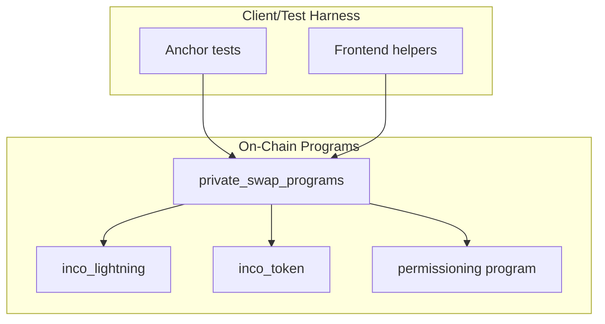
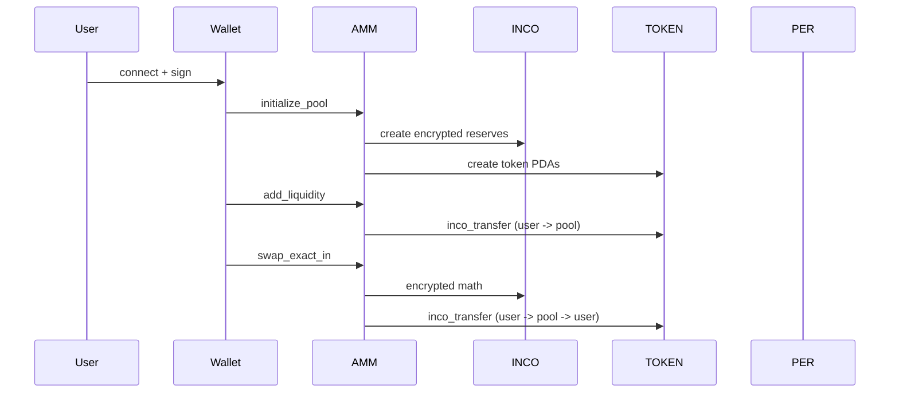

# Velvet Swap Program Architecture

## Overview

`private_swap_programs` implements a confidential AMM on Solana using:

- **Inco Lightning** for encrypted math (`Euint128` operations).
- **inco_token** for confidential SPL balances and transfers.
- **MagicBlock PER** to permission pool + token PDA updates.

## System Diagram



## Core Accounts

- **Pool PDA**: stores encrypted reserves and fee config.
- **User Token A/B PDA**: confidential balances for swapper.
- **Pool Token A/B PDA**: confidential balances owned by pool PDA.
- **Permission PDAs**: MagicBlock PER permission state per token PDA.

## Instruction Flow



## Permissioning Rules

- **PER required for devnet** (ephemeral RPC). Pool + token PDAs must be permissioned.
- **Delegate AFTER minting**. Delegating a token PDA before minting can cause ownership errors.

## File Map

```
programs/
├── private_swap_programs/src/   # AMM logic + CPI to inco_token
├── inco-token/src/              # confidential SPL program
└── inco-lightning/              # encrypted math helpers

tests/private_swap_programs.ts  # end-to-end flow
```

## Integration Notes

- Frontend helpers mirror the test sequence for pool init + liquidity.
- `swap_exact_in` expects ciphertext inputs and validates invariant on encrypted values.
