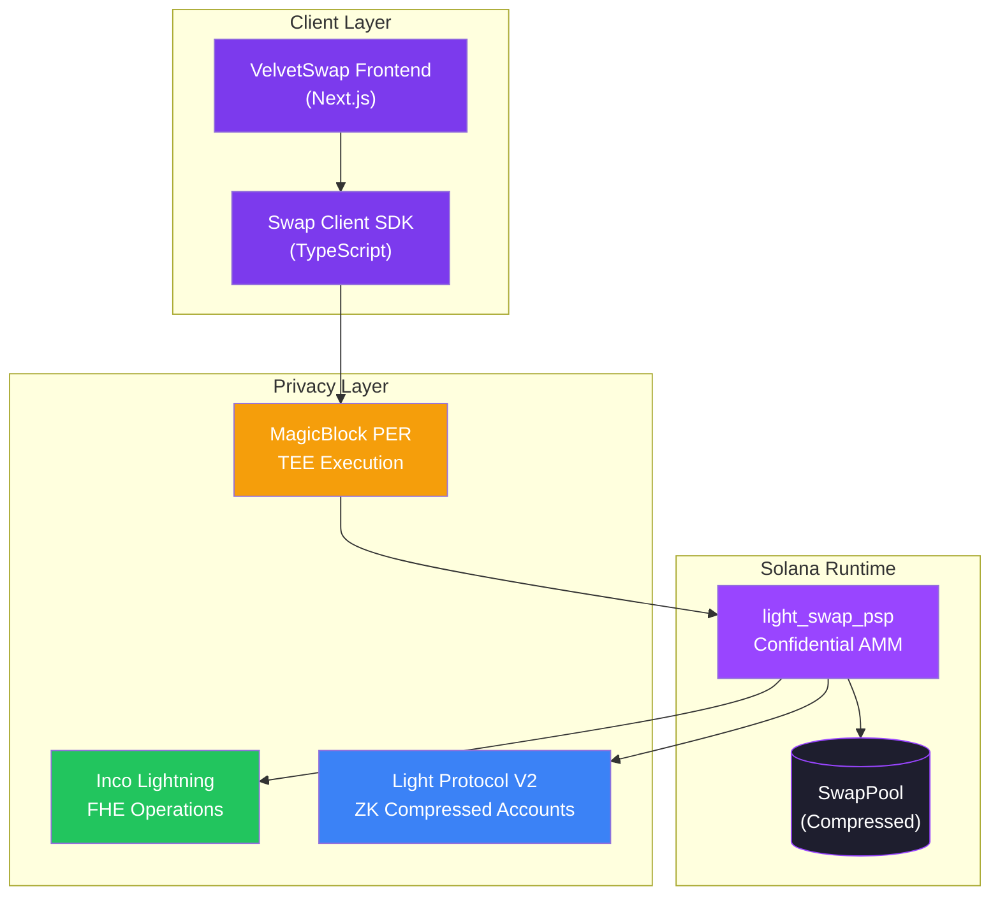
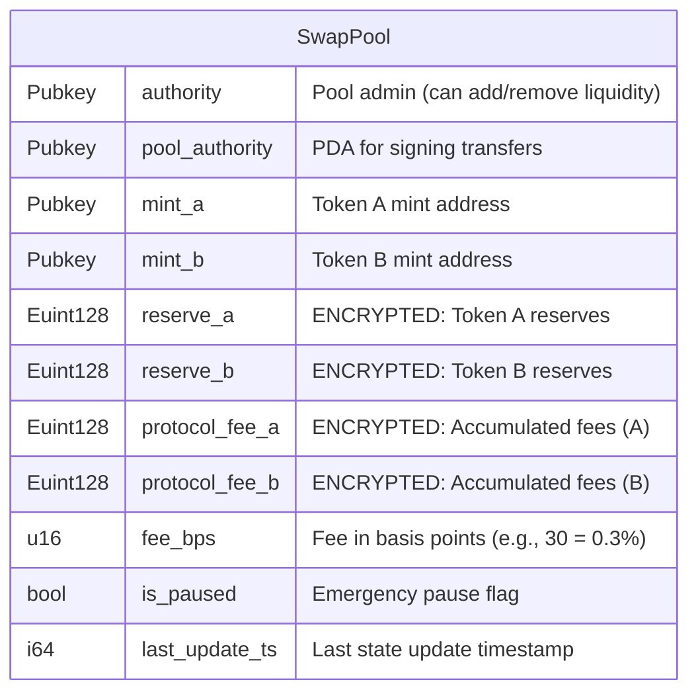
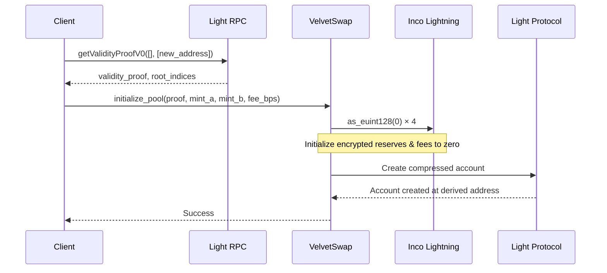
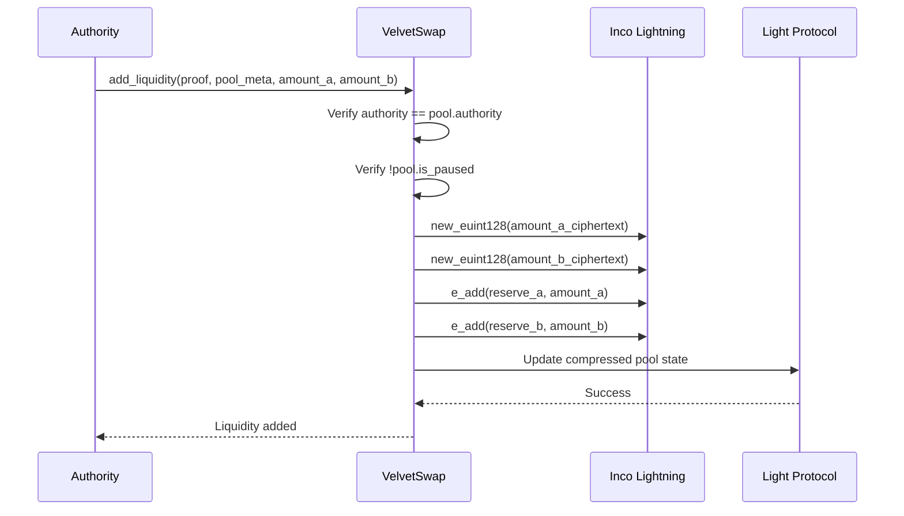
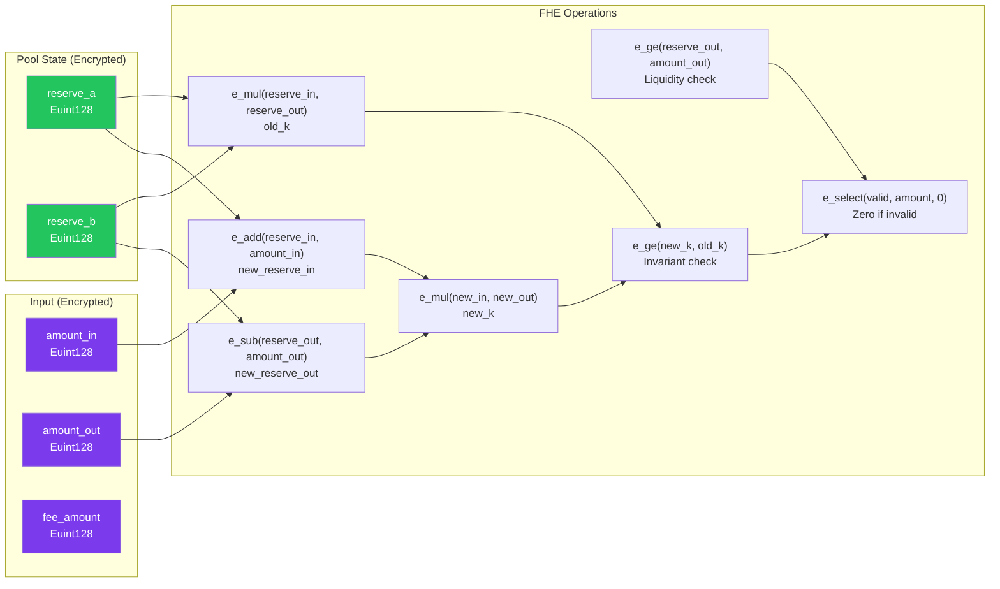
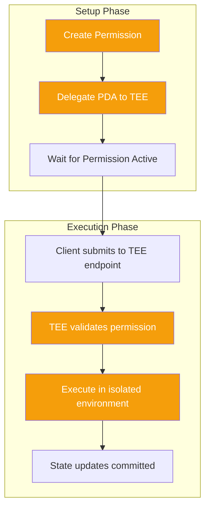
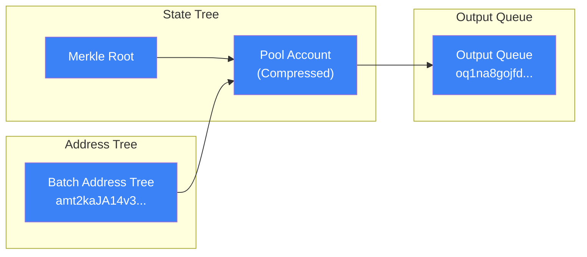
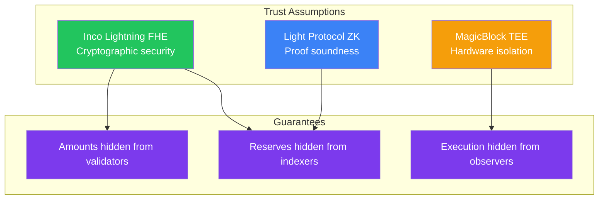

# VelvetSwap Architecture

> Technical deep-dive into the confidential AMM implementation.

---

## System Overview



---

## Core Components

### 1. Pool State (Compressed Account)

The pool state is stored as a **Light Protocol compressed account** with FHE-encrypted fields:



### 2. Pool Authority PDA

Derived deterministically for each token pair:

```
seeds = ["pool_authority", mint_a, mint_b]
pool_authority_pda = PDA(seeds, program_id)
```

This PDA is **delegated to MagicBlock TEE** for private execution.

### 3. Compressed Account Address

Pool address is derived using Light Protocol V2:

```
seeds = ["pool", mint_a, mint_b]
address_seed = deriveAddressSeedV2(seeds)
pool_address = deriveAddressV2(address_seed, batch_address_tree, program_id)
```

---

## Instruction Flow

### Initialize Pool



### Swap Exact In

```mermaid
sequenceDiagram
    participant Client
    participant TEE as MagicBlock TEE
    participant Program as VelvetSwap
    participant Inco as Inco Lightning
    participant Light as Light Protocol

    Client->>Client: Encrypt amounts (FHE)
    Client->>TEE: Submit swap via PER endpoint
    TEE->>Program: swap_exact_in(proof, pool_meta, ciphertexts, a_to_b)
    
    Program->>Program: Load pool state from pool_data
    
    rect rgb(50, 50, 80)
        Note over Program,Inco: FHE Computation (all encrypted)
        Program->>Inco: new_euint128(amount_in_ciphertext)
        Program->>Inco: new_euint128(amount_out_ciphertext)
        Program->>Inco: new_euint128(fee_amount_ciphertext)
        
        Program->>Inco: e_ge(reserve_out, amount_out)
        Note over Inco: Check: has_liquidity?
        
        Program->>Inco: e_mul(reserve_in, reserve_out)
        Note over Inco: old_k = x * y
        
        Program->>Inco: e_add(reserve_in, amount_in)
        Program->>Inco: e_sub(reserve_out, amount_out)
        
        Program->>Inco: e_mul(new_reserve_in, new_reserve_out)
        Note over Inco: new_k = x' * y'
        
        Program->>Inco: e_ge(new_k, old_k)
        Note over Inco: Verify: new_k >= old_k
        
        Program->>Inco: e_select(k_ok, amount, zero)
        Note over Inco: Zero out if invariant violated
    end
    
    Program->>Light: Update compressed pool state
    Light-->>Program: New validity proof
    Program-->>TEE: Swap complete
    TEE-->>Client: Transaction signature
```



### Add/Remove Liquidity



---

## FHE Operations Detail

### Constant Product AMM Math

The swap uses the standard `x * y = k` invariant, but **entirely on encrypted values**:



### Operation Complexity

| Operation | Inco CPI Calls | Purpose |
|-----------|----------------|---------|
| `new_euint128` | 3 | Parse input ciphertexts |
| `as_euint128` | 1 | Create zero constant |
| `e_ge` | 2 | Liquidity + invariant checks |
| `e_add` | 2 | Update reserves |
| `e_sub` | 1 | Update output reserve |
| `e_mul` | 2 | Compute k values |
| `e_select` | 3 | Conditional zeroing |
| **Total** | **14** | Per swap |

---

## MagicBlock PER Integration

### Permission Setup



### Permission Members

```rust
members: [
    { flags: AUTHORITY | TX_LOGS | TX_BALANCES | TX_MESSAGE | ACCOUNT_SIGNATURES, pubkey: authority },
    { flags: AUTHORITY | TX_LOGS | TX_BALANCES | TX_MESSAGE | ACCOUNT_SIGNATURES, pubkey: pool_authority_pda },
    { flags: AUTHORITY | TX_LOGS | TX_BALANCES | TX_MESSAGE | ACCOUNT_SIGNATURES, pubkey: tee_validator },
    { flags: AUTHORITY | TX_LOGS | TX_BALANCES | TX_MESSAGE | ACCOUNT_SIGNATURES, pubkey: program_id },
]
```

---

## Light Protocol V2 Integration

### Compressed Account Flow



### Key Addresses (Devnet)

| Account | Address |
|---------|---------|
| Batch Address Tree | `amt2kaJA14v3urZbZvnc5v2np8jqvc4Z8zDep5wbtzx` |
| Output Queue | `oq1na8gojfdUhsfCpyjNt6h4JaDWtHf1yQj4koBWfto` |
| Light System Program | `SySTEM1eSU2p4BGQfQpimFEWWSC1XDFeun3Nqzz3rT7` |

---

## Error Handling

| Error | Code | Cause |
|-------|------|-------|
| `PoolPaused` | 6000 | Pool is in emergency pause state |
| `InvalidInputMint` | 6001 | Input token doesn't match pool |
| `InvalidOutputMint` | 6002 | Output token doesn't match pool |
| `InvalidPermissionAccount` | 6003 | PDA doesn't match derived address |
| `Unauthorized` | 6004 | Caller is not pool authority |

---

## Security Model



---

## File Structure

```
programs/light_swap_psp/src/lib.rs
├── compute_swap_updates()     # FHE swap math (lines 29-106)
├── create_permission()        # PER permission setup (lines 113-143)
├── delegate_pda()             # TEE delegation (lines 146-160)
├── initialize_pool()          # Pool creation (lines 162-222)
├── add_liquidity()            # LP deposit (lines 224-275)
├── remove_liquidity()         # LP withdrawal (lines 277-328)
├── swap_exact_in()            # Core swap (lines 330-407)
├── Account structs            # Anchor contexts (lines 410-475)
├── SwapPool                   # Pool state struct (lines 477-497)
├── ErrorCode                  # Custom errors (lines 499-511)
└── AccountType + helpers      # PDA derivation (lines 513-526)
```

---

## Performance Characteristics

| Metric | Value | Notes |
|--------|-------|-------|
| Compute Units | ~800,000 | Per swap (FHE heavy) |
| Account Size | ~500 bytes | Compressed pool state |
| Validity Proof | ~1-2 seconds | Light RPC latency |
| TEE Overhead | ~500ms | PER execution |

---

## Future Improvements

1. **Multi-hop routing** — Chain multiple pools for better prices
2. **LP tokens** — Fungible representation of liquidity shares
3. **Attested reveals** — Allow users to prove their swap amounts
4. **Fee distribution** — Automated protocol fee collection
