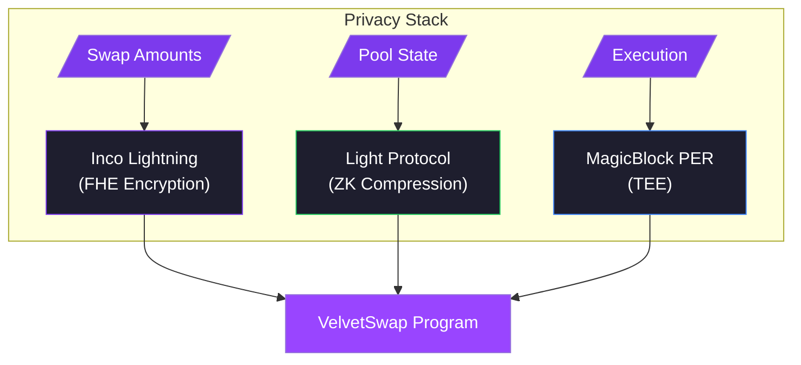
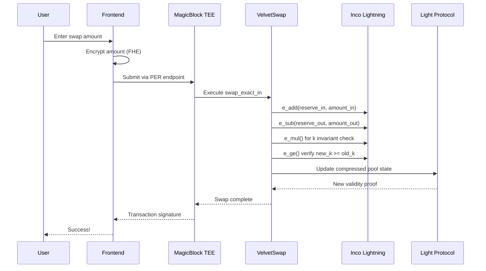
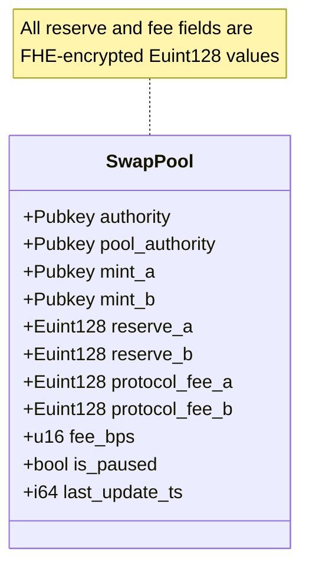

# VelvetSwap — Confidential AMM for Solana

<p align="center">
  <strong>The first fully confidential AMM on Solana</strong><br/>
  Swap amounts, pool reserves, and fee accounting are <em>all encrypted</em>.
</p>

<p align="center">
  
  
  
</p>

---

## Overview

VelvetSwap is a **constant-product AMM** where nobody — not validators, not indexers, not MEV bots — can see how much you're swapping.



---

## Deployed Program

| Field | Value |
|-------|-------|
| **Program ID** | `4b8jCufu7b4WKXdxFRQHWSks4QdskW62qF7tApSNXuZD` |
| **Network** | Solana Devnet |
| **Permanent Pool** | SOL/USDC @ `1QJcNYRBuDKQnWQofUQNwFg9MRoqgoLAUhW5js2ApS2` |
| **Explorer** | [View on Solscan](https://solscan.io/account/4b8jCufu7b4WKXdxFRQHWSks4QdskW62qF7tApSNXuZD?cluster=devnet) |

---

## Privacy Architecture

### What's Hidden?

| Data | Visibility | Technology |
|------|------------|------------|
| Swap input amount | **Encrypted** | Inco FHE `Euint128` |
| Swap output amount | **Encrypted** | Inco FHE `Euint128` |
| Pool reserves (A & B) | **Encrypted** | Inco FHE `Euint128` |
| Protocol fees | **Encrypted** | Inco FHE `Euint128` |
| Pool state location | **Compressed** | Light Protocol ZK proofs |
| Transaction execution | **TEE-shielded** | MagicBlock PER |

### Confidential Swap Flow



---

## Program Instructions

| Instruction | Description | Access |
|-------------|-------------|--------|
| `initialize_pool` | Create compressed pool with encrypted zero reserves | Anyone |
| `add_liquidity` | Add encrypted liquidity to pool | Authority only |
| `remove_liquidity` | Remove encrypted liquidity from pool | Authority only |
| `swap_exact_in` | Execute private swap with FHE constant-product math | Anyone |
| `create_permission` | Setup MagicBlock PER permissions for pool authority | Anyone |
| `delegate_pda` | Delegate pool authority PDA to TEE validator | Anyone |

---

## Pool State (Encrypted)



---

## FHE Operations

The program uses Inco Lightning's encrypted arithmetic for all pool math:

```rust
// Encrypted addition: reserve + amount
e_add(reserve_in, amount_in)

// Encrypted subtraction: reserve - amount  
e_sub(reserve_out, amount_out)

// Encrypted multiplication: x * y = k
e_mul(reserve_a, reserve_b)

// Encrypted comparison: new_k >= old_k
e_ge(new_k, old_k)

// Encrypted conditional: if condition then a else b
e_select(has_liquidity, amount, zero)
```

---

## Repository Structure

```
private_swap_programs/
├── programs/
│   └── light_swap_psp/
│       └── src/lib.rs          # Main program (527 lines)
├── tests/
│   └── light_swap_psp.ts       # Integration tests
├── scripts/
│   └── init-permanent-pool.ts  # Pool initialization script
├── target/
│   ├── idl/light_swap_psp.json # Program IDL
│   └── types/                  # TypeScript types
├── Anchor.toml
├── Cargo.toml
└── package.json
```

---

## Quick Start

### Prerequisites

- Solana CLI with devnet configured
- Node.js 18+
- Anchor 0.32+

### Install & Test

```bash
# Install dependencies
npm install

# Initialize permanent SOL/USDC pool (one-time)
npm run init-pool

# Run integration tests
npm run ts-mocha

# Deploy program (requires devnet SOL)
anchor deploy --provider.cluster devnet
```

### Environment Variables

```bash
# Optional: Use your own Helius API key for better rate limits
export HELIUS_DEVNET_API_KEY=your_key_here

# Wallet path (defaults to ~/.config/solana/id.json)
export ANCHOR_WALLET=/path/to/wallet.json
```

---

## Integration Example

```typescript
import { initializePool, swapExactIn, fetchPoolState } from './swap-client';

// Check if pool exists
const pool = await fetchPoolState(WSOL_MINT, USDC_MINT);

// Execute encrypted swap
const tx = await swapExactIn({
    connection,
    wallet,
    mintA: WSOL_MINT,
    mintB: USDC_MINT,
    amountInCiphertext: encryptedAmount,
    amountOutCiphertext: encryptedOutput,
    feeAmountCiphertext: encryptedFee,
    aToB: true,
});
```

---

## Security Considerations

- **FHE Encryption**: All amounts are encrypted client-side before submission
- **ZK Proofs**: Light Protocol validates state transitions without revealing data
- **TEE Execution**: MagicBlock PER ensures computation happens in isolated environment
- **Authority Controls**: Only pool authority can add/remove liquidity

---

## Related Links

| Resource | URL |
|----------|-----|
| Frontend | [velvet-rope](../velvet-rope) |
| Inco Lightning Docs | https://docs.inco.org/svm/home |
| MagicBlock PER Docs | https://docs.magicblock.gg/pages/private-ephemeral-rollups-pers |
| Light Protocol Docs | https://docs.lightprotocol.com |

---

## License

MIT

---

<p align="center">
  Built for <strong>Solana Privacy Hackathon 2026</strong> 🏴‍☠️
</p>
