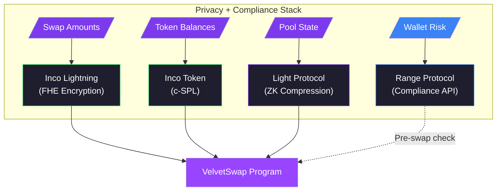
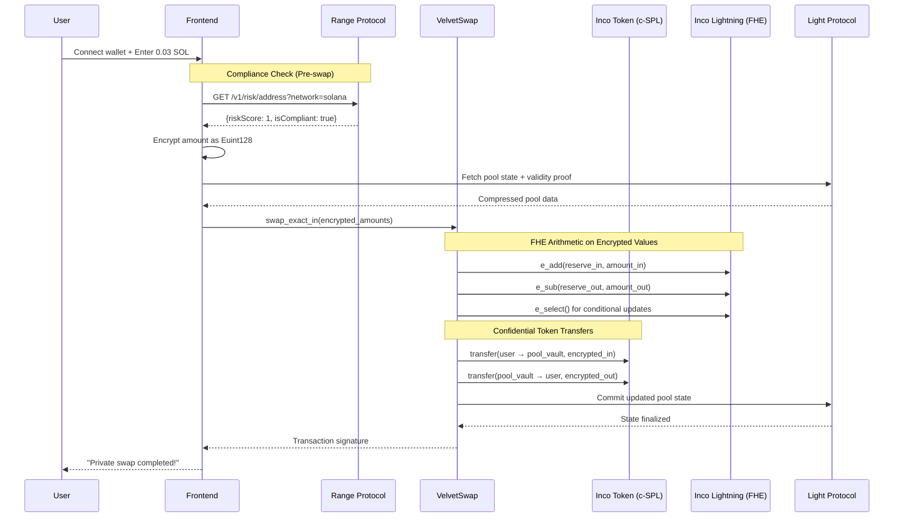
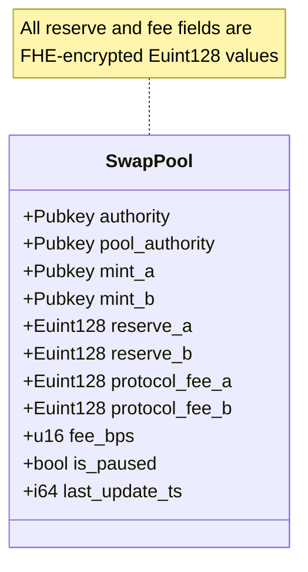

# VelvetMesh by VelvetSwap

> No shared pools. No leaked intent. Verified private fills.

VelvetMesh is private poolless liquidity for Solana. It extends the existing
VelvetSwap confidential AMM into a private P2P intent/RFQ network where users
create encrypted trade intents and makers, fillers, or agents compete to fill
them privately.

VelvetSwap remains the confidential AMM fallback and settlement layer. The
existing `light_swap_psp` program is preserved; VelvetMesh is added as a new
layer beside it, not as a rewrite.

## Hackathon Focus

The core target is Arcium-powered private matching for capital markets:

- **Arcium**: confidential RFQ matching over encrypted user intents and maker
  quotes.
- **Umbra**: shielded payout or withdrawal flows after a private match is
  verified.
- **MagicBlock**: real-time private RFQ sessions for maker/filler quote flow.

Secondary modules are documented but not core to the product thesis:

- Encrypt as an alternative encrypted-compute track if needed.
- Ika as a parked future bridgeless route only, because the current Solana
  pre-alpha uses mock-signer semantics.
- Torque for maker/filler incentives.
- Jupiter for public fallback quotes and routing comparison.

## Program Shape

The new Anchor program lives under `programs/velvet_mesh` and stores private
intent/RFQ state with Arcium-oriented computation request/result fields.
VelvetSwap remains the existing confidential AMM fallback and settlement
foundation.

## Target Architecture

```txt
User
  -> VelvetMesh private intent/RFQ layer
    -> Arcium confidential RFQ computation
    -> private maker/filler quote selection
    -> settlement router
      -> direct Solana P2P fill
      -> VelvetSwap confidential AMM fallback
      -> Umbra shielded payout path
      -> MagicBlock real-time RFQ session handoff
      -> Jupiter public fallback quote
```

## Current Implementation Status

The current repo contains the existing VelvetSwap Anchor program under
`programs/light_swap_psp`. It uses Light Protocol compressed accounts, Inco
encrypted values, Inco Token confidential token transfers, and MagicBlock
dependencies in test/demo scripts.

The new `programs/velvet_mesh` program adds the Rust state machine for private
intent creation, quote submission, Arcium match requests, verifier-recorded
private match results, accepted matches, and settlement readiness.

Arcium matching is not mocked. Arcium-backed intents can request private
matching, but they cannot be accepted for settlement until the configured match
verifier records a selected quote whose commitment, route, and computation id
match the requested private computation. In production that verifier should be
the Arcium matcher's signer PDA used by the verified callback path, not a user
wallet.

Ika is intentionally parked for this submission. The Ika Solana pre-alpha
surface is useful for future route design, but the current public developer
guide says it uses a single mock signer and has no real distributed MPC security
guarantees yet. VelvetMesh should therefore focus the current product demo on
Arcium, Umbra, and MagicBlock, and avoid presenting Ika as an active sponsor
integration until Ika's real Solana MPC path is available.

Sponsor settlement is not a frontend-only toggle. Accepted matches now require
a `prepare_settlement_handoff` payload before `mark_settlement_ready` can
succeed, and settlement readiness must be confirmed by the configured
`settlement_verifier`. The TypeScript sponsor adapters under `src/sponsors`
use MagicBlock's live Private Payments API and the real `@umbra-privacy/sdk`
package; missing sponsor payloads fail closed instead of falling back to mocks.

Important limitation: the current `compute_swap_updates` function in
`programs/light_swap_psp/src/lib.rs` is a demo passthrough. The repo should not
claim production-complete encrypted constant-product reserve math until that
path is implemented and verified.

## Demo Script

Use this flow for the recording:

1. Open the VelvetMesh frontend on devnet and connect the funded wallet.
2. Create a fresh `25 USDC -> SOL` private intent.
3. Request the private match and show the intent move to match-ready.
4. Accept the selected quote once the Arcium path is ready.
5. Run `Settle USDC + shield wSOL`.
6. Show the MagicBlock signature, the Umbra queue/callback signatures, and the recorded receipt in intent history.
7. Open Solana Explorer and verify the real devnet transactions.

The product story in the video should stay simple: Arcium matches privately,
MagicBlock pays the USDC leg, and Umbra shields the wSOL payout balance.

---

# VelvetSwap — Confidential AMM for Solana

[](https://solana.com)
[](https://lightprotocol.com)
[](https://inco.network)
[](https://range.org)

## Privacy + Compliance Stack

| Layer | Technology | Purpose |
|-------|------------|------------------|
| **FHE (Inco Lightning)** | Homomorphic encryption | Pool reserves, swap amounts, fees - all encrypted as `Euint128` |
| **c-SPL (Inco Token)** | Confidential tokens | User balances stored encrypted, transfers hide amounts |
| **ZK (Light Protocol V2)** | Zero-knowledge proofs | Pool state stored as compressed account with validity proofs |
| **Compliance (Range)** | Risk API | Sanctions screening & wallet risk scoring before swaps |

---

## Demo Video

https://github.com/user-attachments/assets/baf6b35d-6741-479c-9336-4effe6609f7e

## Demo Script

Use [docs/DEMO_SCRIPT.md](docs/DEMO_SCRIPT.md) as the recording runbook. It matches the current product flow: create a private intent, request or accept the private match, settle the USDC leg through MagicBlock, and shield the payout balance through Umbra.


## Overview

VelvetSwap is a **constant-product AMM** where nobody — not validators, not indexers, not MEV bots — can see how much you're swapping.


```mermaid
graph TB
    subgraph "Privacy + Compliance Stack"
        A[/"Swap Amounts"/] --> INCO["Inco Lightning<br/>(FHE Encryption)"]
        B[/"Token Balances"/] --> TOKEN["Inco Token<br/>(c-SPL)"]
        C[/"Pool State"/] --> LIGHT["Light Protocol<br/>(ZK Compression)"]
        D[/"Wallet Risk"/] --> RANGE["Range Protocol<br/>(Compliance API)"]
    end
    
    INCO --> PROGRAM["VelvetSwap Program"]
    TOKEN --> PROGRAM
    LIGHT --> PROGRAM
    RANGE -.->|Pre-swap check| PROGRAM
    
    style A fill:#7C3AED,color:#fff
    style B fill:#7C3AED,color:#fff
    style C fill:#7C3AED,color:#fff
    style D fill:#3B82F6,color:#fff
    style INCO fill:#1e1e2e,color:#fff,stroke:#22C55E
    style TOKEN fill:#1e1e2e,color:#fff,stroke:#22C55E
    style LIGHT fill:#1e1e2e,color:#fff,stroke:#7C3AED
    style RANGE fill:#1e1e2e,color:#fff,stroke:#3B82F6
    style PROGRAM fill:#9945FF,color:#fff
```

---

## Deployed Program

| Field | Value |
|-------|-------|
| **Program ID** | `4b8jCufu7b4WKXdxFRQHWSks4QdskW62qF7tApSNXuZD` |
| **Network** | Solana Devnet |
| **Inco Token Program** | `CYVSeUyVzHGVcrxsJt3E8tbaPCQT8ASdRR45g5WxUEW7` |
| **Inco Lightning Program** | `5sjEbPiqgZrYwR31ahR6Uk9wf5awoX61YGg7jExQSwaj` |
| **Pool Authority PDA** | `DSM8WDdZ5s3xkKbjtmzxpd59J42cuTZ1AJtFJTzLMkFS` |
| **Inco Mint A (wSOL)** | `4AJDgxnHDNP7y9wSD24sP7YUhQrMyprLUeuRwEwYu6cy` |
| **Inco Mint B (USDC)** | `CvymLX1Tm6btpRJdfGeQ34k726yQnXSn1V7G4fworMaG` |
| **Pool Vault A** | `8cEgrChzTtBxucAFqSnM5QAR1NuKRZEs5Z1U9QEfLsKi` |
| **Pool Vault B** | `DoESWTXqLEiKyUWVUGKXhTQXrL3oN5HLiRxG781W8Hwx` |
| **Example Swap TX** | [View on Explorer](https://explorer.solana.com/tx/3kbJFHbfGKVKyf6xEs5jLnWcYnRjh7mNQa6o6kXjbRhGQb8kQMhnzhFaQA8WDE4joHGExxmguSRTJfGqMXpeHogB?cluster=devnet) |

---

## Privacy Architecture

### What's Hidden?

| Data | Visibility | Technology |
|------|------------|------------|
| Swap input amount | **Encrypted** | Inco FHE `Euint128` |
| Swap output amount | **Encrypted** | Inco FHE `Euint128` |
| Pool reserves (A & B) | **Encrypted** | Inco FHE `Euint128` |
| Protocol fees | **Encrypted** | Inco FHE `Euint128` |
| Pool state location | **Compressed** | Light Protocol ZK proofs |
| Token balances | **Encrypted** | Inco Token c-SPL |

### Confidential Swap Flow


```mermaid
sequenceDiagram
    participant User
    participant Frontend
    participant Range as Range Protocol
    participant Program as VelvetSwap
    participant IncoToken as Inco Token (c-SPL)
    participant IncoFHE as Inco Lightning (FHE)
    participant Light as Light Protocol

    User->>Frontend: Connect wallet + Enter 0.03 SOL
    
    Note over Frontend,Range: Compliance Check (Pre-swap)
    Frontend->>Range: GET /v1/risk/address?network=solana
    Range-->>Frontend: {riskScore: 1, isCompliant: true}
    
    Frontend->>Frontend: Encrypt amount as Euint128
    Frontend->>Light: Fetch pool state + validity proof
    Light-->>Frontend: Compressed pool data
    Frontend->>Program: swap_exact_in(encrypted_amounts)
    
    Note over Program,IncoFHE: FHE Arithmetic on Encrypted Values
    Program->>IncoFHE: e_add(reserve_in, amount_in)
    Program->>IncoFHE: e_sub(reserve_out, amount_out)
    Program->>IncoFHE: e_select() for conditional updates
    
    Note over Program,IncoToken: Confidential Token Transfers
    Program->>IncoToken: transfer(user → pool_vault, encrypted_in)
    Program->>IncoToken: transfer(pool_vault → user, encrypted_out)
    
    Program->>Light: Commit updated pool state
    Light-->>Program: State finalized
    Program-->>Frontend: Transaction signature
    Frontend-->>User: "Private swap completed!"
```

---

## Program Instructions

| Instruction | Description | Access |
|-------------|-------------|--------|
| `initialize_pool` | Create compressed pool with encrypted zero reserves | Anyone |
| `add_liquidity` | Add encrypted liquidity to pool | Authority only |
| `remove_liquidity` | Remove encrypted liquidity from pool | Authority only |
| `swap_exact_in` | Execute private swap with FHE constant-product math | Anyone |
| `swap_exact_out` | Execute private swap specifying exact output | Anyone |

## VelvetMesh Program Instructions

| Instruction | Description | Access |
|-------------|-------------|--------|
| `create_intent` | Create an encrypted private RFQ intent with allowed settlement routes and a match verifier | Intent owner |
| `submit_quote` | Submit an encrypted maker/filler quote commitment for an open intent | Maker/filler |
| `request_private_match` | Move an Arcium intent into private computation after enough quotes exist | Intent owner |
| `record_private_match` | Bind a verified computation result to a selected quote commitment and route | Configured match verifier |
| `accept_quote` | Accept the selected private quote and create an accepted match | Intent owner |
| `prepare_settlement_handoff` | Record a sponsor settlement payload hash for Umbra, MagicBlock, or direct settlement | Intent owner |
| `mark_settlement_ready` | Confirm a prepared settlement handoff | Configured settlement verifier |
| `cancel_intent` | Cancel an open intent before private computation/acceptance | Intent owner |

## Backend Validation

```bash
npm run test:sponsors:live
ANCHOR_PROVIDER_URL="https://devnet.helius-rpc.com/?api-key=..." npm run test:velvetmesh:devnet
```

`test:sponsors:live` calls MagicBlock's public Private Payments API and creates
a real Umbra devnet SDK client. It also registers or verifies the funded devnet
wallet as an Umbra confidential user through the real SDK. The Umbra adapter
checks the real devnet relayer supported-mint list before deposit/withdraw, so
unsupported mints fail closed instead of pretending to work. The first live
registration produced finalized devnet signatures:

- `L3zg7B2e9qxcRH44FyH9QazxaE27zFmd96XmpPB7mQkNRZsRFTFzTr7ubq58zX4V9LCKdF18RVCAvRH9S95UKbE`
- `4rwfBazV6zXaxYyR6DJLT87FEUNJQtr7aFZTZsXrToKSVsNT2mfbVrTsCzzFm3K7Ycnq6hPUnDdCgN8uijyRDQLQ`

The verified Umbra asset path is devnet wSOL. A custom devnet mint failed
correctly with Umbra's `fee_schedule AccountNotInitialized`, while supported
wSOL deposit/withdraw finalized through real Arcium callbacks:

- Deposit callback: `4DmkaC7SM71Qq3vurz49Z5UnUYHe8iPHke6Wxkdy2UvPky6RfrrPMjC6ddVora33w1eB11nTwGByRZgxhDRmwWyE`
- Withdrawal callback: `3W5cDragn7v5Z8s9h4HD4qL9PmXAR39a28tfwKJf94uVqgXhkj88UtFwmKucK3uUDZPTyTmmxGjqAyMXvsMtHRR3`

`test:velvetmesh:devnet` validates the on-chain state machine, including a real
MagicBlock transaction-build payload committed through
`prepare_settlement_handoff`, plus rejection of zero sponsor payloads, wrong
settlement verifiers, and double settlement confirmations.

---

## Pool State (Encrypted)


```mermaid
classDiagram
    class SwapPool {
        +Pubkey authority
        +Pubkey pool_authority
        +Pubkey mint_a
        +Pubkey mint_b
        +Euint128 reserve_a
        +Euint128 reserve_b
        +Euint128 protocol_fee_a
        +Euint128 protocol_fee_b
        +u16 fee_bps
        +bool is_paused
        +i64 last_update_ts
    }
    
    note for SwapPool "All reserve and fee fields are<br/>FHE-encrypted Euint128 values"
```

---

## FHE Operations

The program uses Inco Lightning's encrypted arithmetic for all pool math:

```rust
// Encrypted addition: reserve + amount
e_add(reserve_in, amount_in)

// Encrypted subtraction: reserve - amount  
e_sub(reserve_out, amount_out)

// Encrypted multiplication: x * y = k
e_mul(reserve_a, reserve_b)

// Encrypted comparison: new_k >= old_k
e_ge(new_k, old_k)

// Encrypted conditional: if condition then a else b
e_select(has_liquidity, amount, zero)
```

---

## Repository Structure

```
private_swap_programs/
├── programs/
│   └── light_swap_psp/
│       └── src/lib.rs          # Main program (527 lines)
├── tests/
│   └── light_swap_psp.ts       # Integration tests
├── scripts/
│   └── init-permanent-pool.ts  # Pool initialization script
├── target/
│   ├── idl/light_swap_psp.json # Program IDL
│   └── types/                  # TypeScript types
├── Anchor.toml
├── Cargo.toml
└── package.json
```

---

## Quick Start

### Prerequisites

- Solana CLI with devnet configured
- Node.js 18+
- Anchor 0.32+

### Install & Test

```bash
# Install dependencies
npm install

# Initialize permanent SOL/USDC pool (one-time)
npm run init-pool

# Run integration tests
npm run ts-mocha

# Deploy program (requires devnet SOL)
anchor deploy --provider.cluster devnet
```

### Environment Variables

```bash
# Optional: Use your own Helius API key for better rate limits
export HELIUS_DEVNET_API_KEY=your_key_here

# Wallet path (defaults to ~/.config/solana/id.json)
export ANCHOR_WALLET=/path/to/wallet.json
```

---

## Integration Example

```typescript
import { initializePool, swapExactIn, fetchPoolState } from './swap-client';

// Check if pool exists
const pool = await fetchPoolState(WSOL_MINT, USDC_MINT);

// Execute encrypted swap
const tx = await swapExactIn({
    connection,
    wallet,
    mintA: WSOL_MINT,
    mintB: USDC_MINT,
    amountInCiphertext: encryptedAmount,
    amountOutCiphertext: encryptedOutput,
    feeAmountCiphertext: encryptedFee,
    aToB: true,
});
```

---

## Security & Compliance

- **FHE Encryption**: All amounts are encrypted client-side before submission
- **ZK Proofs**: Light Protocol validates state transitions without revealing data
- **Confidential Tokens**: Inco Token c-SPL hides user balances from observers
- **Sanctions Screening**: Range Protocol checks wallets against OFAC/EU/UK sanctions lists
- **Authority Controls**: Only pool authority can add/remove liquidity

---

## Related Links

| Resource | URL |
|----------|-----|
| Frontend | [VelvetSwap Frontend](https://github.com/VelvetSwap/Velvet_frontend) |
| Inco Lightning Docs | https://docs.inco.org/svm/home |
| Light Protocol Docs | https://docs.lightprotocol.com |
| Range Protocol Docs | https://docs.range.org/risk-api/risk-introduction |
| Range Risk API | https://api.range.org/v1/risk/address |

---

## License

MIT

---

<p align="center">
  Built for <strong>Solana Privacy Hackathon 2026</strong> 🏴‍☠️
</p>
